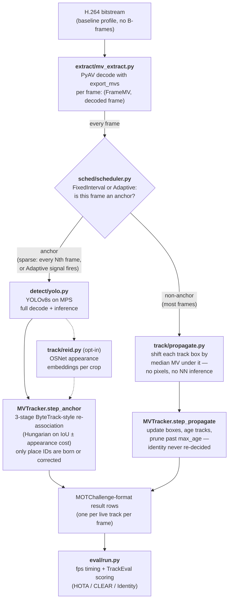

# mvtrack — System Design

This document explains, end to end, how mvtrack works: the problem it solves,
the architecture that solves it, every major design decision along the way
(including the ones that failed and were reverted), and the exact path a video
takes from an H.264 bitstream to a scored HOTA/MOTA/IDF1 number. It is the
"why" companion to `README.md` (results summary) and `findings.md` (per-change
measurements). Where a claim here has a number behind it, the findings entry
is cited as `findings.md #N`.

---

## 1. Problem statement and core idea

Multi-object tracking (MOT) pipelines conventionally do the same expensive
thing on every frame: fully decode the frame to pixels, run a neural-network
detector on those pixels, and associate the detections with existing tracks.
On hardware without a dedicated inference budget to burn — this project
targets a single Apple M4, PyTorch MPS, no CUDA/NVDEC — the detector
dominates cost and caps how many concurrent video streams one chip can
analyze.

The core observation: **the video encoder already computed most of the motion
information a tracker needs.** H.264/HEVC encoders spend enormous effort on
motion estimation — every predicted (P) block in the bitstream carries a
motion vector saying "this 16×16 (or smaller) region of pixels came from
*over there* in a reference frame." That is, structurally, the same quantity
a Kalman filter's predict step tries to estimate from scratch. mvtrack reads
those motion vectors out of the compressed bitstream and uses them to
propagate track bounding boxes on most frames, running the full
decode-plus-detector path only on sparse **anchor frames**.

Two things follow from this framing, and both shaped the whole project:

1. **It is a genuine accuracy/throughput tradeoff, not a free win.** Motion
   vectors are rate-distortion-optimized for compression, not for tracking:
   they are block-level, noisy, and carry zero appearance information. Boxes
   drift between anchors. The project's honest headline is the *shape* of
   that tradeoff (how little accuracy must be paid for how much throughput),
   not a claim of matching full-decode accuracy.
2. **The interesting scheduling question is *when* to anchor.** If anchors
   are cheap-ish and drift is scene-dependent, an adaptive scheduler that
   fires anchors exactly when propagation is about to go wrong should beat a
   fixed interval. The bitstream itself supplies the signal (see §5).

Final measured position (MOT17 train, all 7 FRCNN sequences, YOLOv8s):

| Pipeline | HOTA | MOTA | IDF1 | mean fps | relative MOTA drop |
|---|---|---|---|---|---|
| baseline (decode+detect every frame) | 40.5 | 38.9 | 48.6 | 20.8 | — |
| mv-fixed (anchor every 5th frame) | 36.0 | 34.9 | 42.4 | 38.5 | 10.1% |
| mv-adaptive (tuned, ~15-17% anchor rate) | 36.0 | 33.1 | 43.0 | 44.2 | 14.85% |

Both mv pipelines roughly double baseline's concurrent-stream ceiling on the
same chip (4 → 8 streams at ≥25 fps/stream; `findings.md` #6).

---

## 2. Architecture overview



Package layout mirrors the diagram:

```
src/mvtrack/
  extract/mv_extract.py   # bitstream -> FrameMV (MV grid + occupancy)
  detect/yolo.py          # YOLOv8 wrapper (MPS)
  track/propagate.py      # median-MV box propagation
  track/tracker.py        # MVTracker: association + track lifecycle
  track/reid.py           # opt-in OSNet appearance embedding
  track/correct.py        # CorrectionNet (negative result, kept for record)
  sched/scheduler.py      # FixedInterval + Adaptive anchor schedulers
  bench/harness.py        # multi-process multi-stream throughput harness
  mot_gt.py               # shared MOT17 GT loader for dataset scripts
eval/run.py               # the one evaluation harness every pipeline uses
scripts/                  # data prep, tuning sweeps, training, demos, plots
results/                  # committed CSVs + plots (reproducible)
outputs/                  # gitignored scratch (result txts, checkpoints)
```

A deliberate project-level convention: **every pipeline variant runs through
`eval/run.py`**, so accuracy and fps numbers are directly comparable. No
one-off benchmark scripts that quietly measure something different.

---

## 3. Motion-vector extraction (`extract/mv_extract.py`)

### What it produces

For every frame, a `FrameMV` dataclass:

- `mv_grid`: `(H/16, W/16, 2)` float32 — per-16×16-cell forward displacement
  `(dx, dy)` in pixels. "Forward" means dst − src: how far the content moved
  *into* this frame, which is exactly the shift needed to carry a box from
  the reference frame to the current one.
- `occupancy`: `(H/16, W/16)` uint8 — 1 where a block actually carried an MV.
  Zeros mark intra-coded blocks (the encoder gave up on motion-matching
  there) and are load-bearing twice over: propagation ignores empty cells,
  and the adaptive scheduler's entire signal is `1 - occupancy.mean()`.
- `pict_type` (`I`/`P`/`B`) — the scheduler anchors unconditionally on
  I-frames (scene cuts / GOP starts, where no MVs exist at all).

### Design decisions and pitfalls

**PyAV, not a custom FFmpeg build.** FFmpeg exposes motion vectors as frame
side data when decoding with `flags2 +export_mvs`. Two non-obvious gotchas
were burned into the code:

1. Container-level options silently don't reach the decoder in PyAV 17. The
   flag must be set on the stream's codec context
   (`stream.codec_context.flags2 |= Flags2.export_mvs`) *before* the first
   `decode()` call, or side data never appears — with no error.
2. PyAV returns the side data as a raw byte buffer, not an ndarray. It is
   parsed with a hand-built structured dtype (`MV_DTYPE`) matching
   libavutil's 40-byte `AVMotionVector` struct layout exactly (explicit
   offsets, including the 8-byte-aligned uint64 flags field).

**This is the "correctness-baseline" decode path, deliberately.** Frames are
still fully decoded to pixels even on non-anchor frames (the pixels are just
unused there). A cheaper path — `skip_idct`/`skip_loop_filter` to skip pixel
reconstruction on non-anchor frames — was designed as a later drop-in behind
the same `FrameMV` interface, but the current numbers already show decode is
not the bottleneck (see the vectorization story below), so correctness came
first.

**B-frames are excluded at the encoding stage, not handled.** All input video
(both the smoke-test clip and re-encoded MOT17) is baseline-profile H.264
with `-bf 0`. Backward-referencing vectors point the wrong way for forward
propagation; `_frame_mv` flips vectors with `source > 0` as a partial
defense, but the propagation logic has not been validated on B-frame content,
so the data-prep scripts simply never produce it. A real deployment on
arbitrary video would need this handled properly.

**The 35× vectorization that made the whole result real (`findings.md` #3).**
The original grid builder looped in Python over every MV to paint grid
cells. On the low-res smoke clip this was invisible; on MOT17's 1920×1080
(~9k MVs/frame) it cost 22 ms/frame — *more than full decode itself*
(7.7 ms/frame) — which is why an early throughput win didn't reproduce on
real data. The fix exploits an H.264 structural fact: partition shapes
(16×16, 16×8, 8×16, 8×8) always tile within one 16-px-aligned macroblock, so
every MV maps to exactly one grid cell — no range-painting needed, just a
NumPy scatter assignment. Verified bit-identical against the old loop on 200
real frames before being trusted. Now 0.63 ms/frame; decode dominates again.
Without this fix, MOT17's resolution would have erased the entire
detector-skipping benefit, and the project's headline numbers would be
illusory.

---

## 4. Box propagation (`track/propagate.py`)

The compressed-domain primitive: for each live track box, take all
MV-carrying grid cells the box overlaps, and shift the whole box by the
**median** `(dx, dy)` of those cells. Boxes covering no occupied cells (on
I-frames, or over static/intra regions) pass through unchanged. Output is
clipped to frame bounds.

Decisions embedded in those few lines:

- **Median, not mean.** Block MVs are noisy and multi-modal (background
  cells inside a loose box, limbs moving differently from the torso). The
  median is robust to a minority of background/outlier cells without any
  explicit foreground segmentation.
- **Rigid translation only — scale correction was tried and reverted
  (`findings.md` #12).** A per-edge variant (shift each box edge by the
  *local* median MV near that edge, so diverging/converging MV fields grow/
  shrink the box) was implemented, verified correct on 5 synthetic MV-field
  scenarios, and measured on real MOT17: MOTA *dropped* in both pipelines.
  Diagnosis: MOT17 pedestrians mostly move laterally (little genuine scale
  change to capture), while the per-edge bands are only 1-2 of the coarse
  16-px cells wide — their medians are much noisier than the whole-box
  median, and the added box-size jitter cost more localization precision
  than occasional real scale correction saved. Reverted rather than kept.
- **A learned correction on top of propagation was also tried and does not
  earn its cost (`findings.md` #4-5, §9 below).**

This function stands in for the Kalman predict step of a conventional
tracker. That is the project's entire substitution in one sentence: *the
predict comes from the codec instead of a motion model.*

---

## 5. Anchor scheduling (`sched/scheduler.py`)

Two schedulers, both answering one question per frame: does this frame get
full decode + detection?

**`FixedInterval`** (every Nth frame, default 5) is the ablation baseline —
the simplest possible policy, and the reference point for whether adaptivity
earns anything.

**`Adaptive`** fires an anchor when any of three conditions hits:

1. The frame is an I-frame (scene cut or GOP boundary — no MVs exist, and
   content likely changed).
2. The frame's **intra-coded block fraction** (`1 - occupancy.mean()`)
   spikes above `spike_factor ×` a rolling EMA of itself (and above an
   absolute floor of 0.05). Rationale: intra blocks are precisely the
   regions the encoder *failed* to motion-match — new content, complex
   motion, occlusion — which is where MV propagation drifts most. This is a
   proxy for residual energy, used because FFmpeg's side-data API exposes
   motion vectors but **not** decoded residual/DCT coefficients; getting the
   real signal would need a custom FFmpeg build or ctypes into libavcodec.
   The swap-in point is isolated in `Adaptive._signal`'s position in the
   code so a stronger signal can replace it without touching anything else.
3. `max_interval` frames have passed since the last anchor — a safety net so
   a static scene doesn't starve the tracker of corrections indefinitely.

A `min_interval` (2) suppresses spike-triggered anchors immediately after an
anchor, since the EMA needs a beat to re-stabilize and back-to-back anchors
waste the whole point.

**Tuning was not optional (`findings.md` #11).** The scheduler's original
defaults (`max_interval=15, spike_factor=1.6`) were arbitrary and had never
been tuned against ground truth. After the re-association fix (§6) made
anchors more productive, those defaults were anchoring far too rarely: a
16-combination grid search on two held-out tuning sequences (MOT17-09/10,
kept separate from the 7-sequence reporting set) found `max_interval` was
the dominant lever — MOTA fell monotonically as it grew from 8 to 20. The
tuned values (`max_interval=8, spike_factor=1.4`) took mv-adaptive from
HOTA 32.5/MOTA 21.8 to 35.4/25.4 on the full set, at a real fps cost
(62.9 → 44.2, anchor rate ~8% → ~15-17%). This restored mv-adaptive's reason
to exist: same accuracy as mv-fixed, meaningfully faster. An instructive
project lesson sits here: a grid search over dataclass defaults — no new
capability at all — was the second-largest accuracy lever in the entire
project.

---

## 6. Track management and association (`track/tracker.py`)

`MVTracker` is a minimal track manager with two per-frame entry points and a
sharp division of responsibility:

- **`step_propagate(fmv)`** (non-anchor frames): shift every live box via
  `propagate_boxes`, increment each track's `since_detection` age, prune
  tracks past `max_age`. Identity is never re-decided here.
- **`step_anchor(boxes, scores, embeddings=None)`** (anchor frames): the
  only place track IDs are created, matched, or corrected. Detections are
  associated to existing (already-propagated) track boxes via Hungarian
  assignment on an IoU-based cost.

### The three-stage re-association — the biggest single accuracy win

The original `step_anchor` was a single-pass IoU-Hungarian match with a hard
0.3 threshold that spawned a brand-new track ID for *any* unmatched
detection. An anchor-interval ablation (`findings.md` #7) exposed how wrong
that was, via a result that inverted intuition: **MOTA rose monotonically as
anchors got rarer** (1.0 at interval=2 up to 13.5 at interval=10). Every
anchor frame was an independent opportunity for YOLO's imperfect recall to
fail a re-match and fragment an identity — so more "ground-truth checks"
meant more churn, and pure propagation (which never drops a track just
because a detector blinked) looked artificially good.

The rewrite (`findings.md` #10) is a three-stage ByteTrack-style cascade:

1. **Stage 1:** high-confidence detections (score ≥ 0.5) vs. *all* tracks at
   the original IoU threshold (0.3). The core match.
2. **Stage 2:** low-confidence detections get a looser-IoU (0.2) chance to
   *recover* tracks stage 1 left unmatched — ByteTrack's central idea. Low-
   confidence detections never spawn new tracks; unmatched ones are
   discarded as too unreliable to seed an identity.
3. **Stage 3 (grace period):** high-confidence detections still unmatched
   after stage 1 get one final loose-IoU (0.15) chance to reattach to a
   still-unmatched track before falling through to spawning a new ID.

Verified first on a 5-scenario synthetic sanity script (basic match,
low-conf recovery, grace reattachment, full-miss spawn, unmatched-low-conf
discard) — per the project convention of giving every numerical component a
known-answer check before trusting real-data numbers.

Effect: the ablation inversion vanished (MOTA flat at 24.6-26.4 across
intervals 2-10; HOTA/IDF1 now decline with interval as intuition predicts),
and produced-track-ID counts collapsed toward ground truth (interval=5: 545
IDs vs. 546 real, down from ~1070 pre-fix) — direct mechanism-level evidence
that ID fragmentation was the actual problem. This one fix roughly halved
mv-fixed's MOTA gap to baseline without touching MV propagation at all.

### `max_age` tied to anchor cadence — the ghost-track fix

Even after the re-association fix, detector upgrade, and scheduler tuning,
mv pipelines trailed baseline MOTA by ~13-14 points, and that gap was
suspiciously *flat* across anchor intervals 2-10 — if propagation drift were
the cause, shorter intervals should have shrunk it. Two diagnostics nailed
the real cause (`findings.md` #15):

- A recall probe (greedy IoU-recall vs. GT, bucketed by
  frames-since-last-anchor) showed recall on a *fresh anchor frame itself*
  (~43.5% on hard MOT17-04) was nearly identical to recall four propagated
  frames later (~42.7%). The loss wasn't accumulating with distance from the
  anchor — it wasn't drift.
- Comparing CLEAR components on a matched subset: false negatives were
  essentially identical between baseline and mv-fixed (8633 vs. 8648), but
  **false positives were 3.3× higher for mv-fixed** (1257 vs. 4120).

Root cause: a track that went unmatched at an anchor wasn't pruned until
`since_detection > max_age`, and with the old flat default of 30 it kept
being propagated *and reported as a live box* for up to 30 more frames — six
whole anchor cycles of ghost boxes at interval 5. The fix: `max_age` must be
at least the longest possible anchor gap (so a track survives to its next
fair re-match chance) and not much more (so ghosts die promptly). Sweeps
(`scripts/tune_max_age.py`) confirmed the optimum for each pipeline is
exactly its max anchor gap: `max_age = anchor_interval` (5) for mv-fixed,
`max_age = scheduler.max_interval` (8) for mv-adaptive, both now set as
defaults in `eval/run.py`.

A genuine cross-pipeline pitfall was hit on the way and is worth preserving:
applying mv-fixed's tuned `max_age=5` to mv-adaptive **collapsed** it (HOTA
31.7 → 9.5, ID switches 123 → 820), because the adaptive scheduler
legitimately leaves gaps up to 8 frames — pruning at 5 killed live tracks
*before their next anchor could ever arrive*, forcing spurious respawns. No
single constant fits both schedulers; the value must derive from each
pipeline's actual cadence. (`MVTracker`'s own dataclass default stays 30,
documented as a fallback for direct construction only.)

This was the single biggest MOTA win of any pass — bigger than the detector
swap, re-association fix, and scheduler tuning combined — taking the relative
MOTA drop vs. baseline from ~32-35% to 10.1% (mv-fixed) and 14.85%
(mv-adaptive).

### Detector choice (`detect/yolo.py`, `findings.md` #9 and #15)

The detector is a thin `ultralytics` YOLO wrapper on MPS, person class only.
Two ceiling checks bracketed the choice:

- **YOLOv8n → YOLOv8s: adopted.** Consistent real gains on every pipeline
  (HOTA +2.7 to +4.5) at an fps cost proportional to how often each pipeline
  actually runs the detector — baseline paid ~30%, mv-adaptive ~9%. This
  confirmed detector quality was a separable lever from the MV approach.
- **YOLOv8s → YOLOv8m: rejected, instructively.** It raised baseline's MOTA
  (+3.8) far more than mv-fixed's (+0.9), because mv-fixed only exposes ~20%
  of frames to the detector — so a better detector *widened* the relative
  gap (34.4% → 37.8%). A clean negative result: past some point, detector
  upgrades help the comparison target more than the method.

---

## 7. Appearance re-identification (`track/reid.py`, opt-in)

Motion vectors carry zero information about what things *look like* — a
structural ceiling for IoU-only association: it cannot tell two overlapping
people apart or recover an identity across a gap too large for spatial
overlap. `--use-reid` adds an appearance channel (`findings.md` #13):

- On anchor frames, each detection crop is embedded (resized to 256×128,
  L2-normalized feature vector).
- The assignment cost becomes a blend:
  `0.7 × (1 − IoU) + 0.3 × (1 − cosine_sim)` against each track's
  EMA-smoothed embedding (α=0.9, so track appearance is stable).
- Stages 2 and 3 — the loosest, most recovery-prone stages — additionally
  require a minimum cosine similarity (0.4), guarding against recovering the
  *wrong* person with a plausible-IoU box.

The embedding source went through one full diagnose-and-fix cycle:

1. **First pass: generic ImageNet-pretrained MobileNetV3-Small. Measured
   flat** on every tracking metric — but a diagnostic showed it was
   genuinely *changing* ~26% of real Hungarian assignments on the most
   crowded sequence, so the signal wasn't gated into irrelevance; it just
   wasn't correct enough on net. Diagnosis: a classification backbone
   encodes "this is a person" (category), not "this is *this* person"
   (identity) — exactly the gap ReID metric-learning training exists to
   close.
2. **Fix: OSNet x0.25 (Zhou et al., ICCV'19), pretrained by its original
   authors on MSMT17** (4101 identities, 15 cameras — a real person-ReID
   benchmark). Deliberately *not* fine-tuned on MOT17: the identity pool is
   small and overfitting risk real, and the point is a generalizable
   embedding. Sourced from Hugging Face Hub (`kaiyangzhou/osnet`) rather
   than torchreid's flaky Google-Drive model zoo. Verified before wiring in:
   checkpoint loads with 0 missing/0 unexpected keys, and on real MOT17
   crops its same-vs-different-identity cosine gap (0.511) beats the generic
   backbone's (0.428).

Result: real HOTA +0.77 / IDF1 +1.11 on mv-fixed (less on mv-adaptive), at
an ~11-12% fps cost. **Kept opt-in, not default**, for a stated reason: the
project's headline claim is streams-per-chip throughput, and that claim
shouldn't quietly get more expensive by default. It's a Pareto option for
users who value identity consistency (IDF1) over raw fps.

One cosmetic gotcha preserved in the code: Apple's Accelerate BLAS (numpy's
default backend on Apple Silicon) raises spurious divide-by-zero/overflow
warnings on some embedding matmuls; the output was verified correct against
a manual dot-product loop, and the warning is suppressed at the call site
(`np.errstate`) rather than anything about the computation being changed.

---

## 8. End-to-end walkthrough of one evaluation run

`python eval/run.py --pipeline mv-adaptive` does the following, exactly:

1. **Data precondition** (one-time, `scripts/prep_mot17.py`): MOT17 ships as
   JPEG image sequences; since the whole project operates on compressed
   bitstreams, each train sequence's FRCNN directory (the three detector
   variants share identical frames/GT, so only one is used) is encoded to
   baseline-profile H.264 — `-bf 0` (no B-frames, see §3), `-g 30` (GOP
   size, so I-frames recur), CRF 23, native fps from `seqinfo.ini` — into
   `data/MOT17/videos/<seq>-FRCNN.mp4`. The dataset itself comes from a
   Kaggle mirror because motchallenge.net has been unreachable across many
   sessions.
2. **Per sequence**, `run_mv_adaptive` constructs: a `Detector` (YOLOv8s,
   MPS), an `Adaptive` scheduler (tuned defaults), and an `MVTracker` with
   `max_age = scheduler.max_interval` (§6). Then for every frame from
   `iter_frames_with_mvs`:
   - The scheduler decides anchor vs. not from the `FrameMV` alone (picture
     type + intra fraction) — before any pixels are touched.
   - **Anchor:** convert the frame to a BGR ndarray, run YOLO, keep
     person-class detections, (optionally embed crops with OSNet), and call
     `tracker.step_anchor`.
   - **Non-anchor:** call `tracker.step_propagate(fmv)` — no pixel
     conversion, no inference.
   - Every live track emits one MOTChallenge CSV row
     (`frame,id,left,top,w,h,conf,-1,-1,-1`) regardless of which path
     produced its box — propagated boxes are reported identically to
     detected ones.
3. **Timing**: fps is `frames / wall_seconds` over the whole loop, including
   decode, so pipeline fps numbers are end-to-end comparable. (Known
   caveat: single-run fps on MPS varies with thermal/load state — the
   project averages runs for Pareto curves and once caught a 2× fps
   "regression" that was actually a load-average-22 machine, documented in
   `findings.md` #15 rather than committed as real.)
4. **Scoring**: results land at `outputs/results/<pipeline>/data/<seq>.txt`,
   a seqmap file is written, and TrackEval's `MotChallenge2DBox` dataset +
   HOTA/CLEAR/Identity metrics run against
   `data/MOT17/train/<seq>-FRCNN/gt/gt.txt`. TrackEval's directory contract
   is rigid; `SKIP_SPLIT_FOL=True` matches this repo's flat layout. Two
   shims are load-bearing: `np.float`/`np.int`/`np.bool` are monkey-patched
   back onto numpy (TrackEval predates numpy 2.0's removal of them), and the
   whole harness was originally validated with a tiny synthetic GT+result
   pair scoring exactly 100% — which is how the numpy issue was caught as a
   config bug rather than a data bug.

The other pipelines differ only in step 2: `baseline` uses ultralytics'
own `model.track(..., tracker="bytetrack.yaml")` full-decode path every
frame (a strong, standard reference, not a strawman); `mv-fixed` replaces
the scheduler with `frames % anchor_interval == 1`; `mv-learned` is mv-fixed
plus a CorrectionNet residual applied after each propagation step.

---

## 9. The learned-correction stretch goal (`track/correct.py`) — a kept negative result

`propagate_boxes` is a zero-order model; it cannot correct partial-occlusion
drift, scale drift, or systematic within-box motion structure. CorrectionNet
was the hypothesis that a tiny learned model could: an MLP
(50-dim input → 64 → 32 → 4) over a 4×4 average-pooled MV/occupancy patch
under the box plus log box size, predicting a scale-invariant residual
(in units of box w/h) on top of the propagated box.

The full arc (`findings.md` #4-5) is preserved because the diagnosis is more
valuable than the outcome:

- **v1** trained on single-step GT pairs (GT box at t → GT box at t+1,
  isolating propagation error from detector error). It beat a zero-residual
  baseline by 19% MSE on held-out regression — and made *every tracking
  metric worse* in the real pipeline. Diagnosis: train/inference
  distribution mismatch (exposure bias). Training always starts from a
  perfect GT box and takes one step; inference chains the net's own
  corrections across multiple already-drifted frames.
- **v2** fixed exactly that, DAgger-style: `build_rollout_dataset.py`
  re-walks real anchor windows using the trained checkpoint itself,
  generating on-policy targets along its own drifted trajectory, and
  retrains from scratch on the aggregate. Rollout targets are heavy-tailed
  (occasional chained blowups in crowded scenes), which destabilized plain
  MSE training (10× val-loss spikes) — switched to SmoothL1 + gradient
  clipping. Result: better val MSE (26% vs. 19% below baseline), better
  MOTA/IDF1 than v1 — the diagnosis was correct and the fix measurably
  worked.
- **And it still loses to doing nothing.** v2 remains worse than plain
  mv-fixed on HOTA and MOTA. Current interpretation: a ~50-param-input MLP
  over pooled MV/occupancy features (no appearance signal) is under-powered
  for the task — its per-frame noise costs more than its average drift
  correction saves, so the tracker's own periodic re-anchoring is a better
  use of the compute. Not pursued; concrete revisit conditions are noted
  (appearance features, or a per-track confidence gate that only applies
  confident corrections).

The code stays in the repo and `mv-learned` stays a runnable pipeline,
because a negative result you can re-run is a finding; one you deleted is a
rumor.

---

## 10. Multi-stream throughput and energy (`bench/harness.py`, `findings.md` #6, #14)

The project's framing claim is capacity: *streams per chip*.
`bench_multistream.py` runs N concurrent instances of a pipeline as separate
**spawned processes** (not threads — YOLO inference holds the GIL enough to
kill thread concurrency, and MPS device contexts are safer one-per-process;
not fork — MPS contexts don't survive it) on the same clip, sweeping N until
per-stream fps drops below 25.

Result (M4, smoke clip, YOLOv8n/pre-fix tracker — not rerun after the
detector swap since a slower detector only lowers all ceilings without
changing the baseline-vs-mv comparison): baseline sustains 4 streams;
mv-fixed and mv-adaptive sustain 8. Aggregate fps saturates past n≈3-4 for
baseline (~111 fps ceiling) vs. ~270/~209 for mv-fixed/mv-adaptive — shared
CPU/GPU contention on one chip makes scaling sublinear for everyone, but the
mv pipelines' ceiling is ~2× higher. Operational gotchas are documented in
`.claude/CLAUDE.md`: sweeps can hang (suspected MPS context contention;
kill and rerun rather than wait), and the harness overwrites its CSV
wholesale, so a killed run must be rerun with the full stream list.

Energy was measured manually (`findings.md` #14) because `powermetrics`
needs sudo and passwordless sudo was deliberately not configured: the user
ran `sudo powermetrics` in their own terminal during a full 7-sequence
mv-adaptive eval. A first short (15s) sample was correctly rejected as noise
(GPU power read *lower* under load — physically implausible); a 150s sample
showed CPU +7%, GPU 2.7× (137 → 505 mW), combined +10.7% vs. idle. Honest
caveats attached: total-system power (not per-process), mismatched
idle-baseline duration, and only one pipeline measured — the full
streams-per-watt comparison remains future work.

---

## 11. Methodology conventions (how the project works, not just what it built)

These recur through every section above and are deliberate policy:

- **One evaluation harness.** Every accuracy or fps number that gets
  compared came out of `eval/run.py` on the same 7 sequences with the same
  TrackEval config. Tuning sweeps use 2 held-out sequences (MOT17-09/10)
  kept separate from final reporting.
- **Synthetic known-answer checks before real-data trust.** The TrackEval
  plumbing was validated with a synthetic 100%-scoring fixture; the
  re-association rewrite, the per-edge scale correction, and the ReID
  blending each got scenario scripts before any MOT17 run. This caught the
  numpy-2.0 shim issue, and made real-data regressions attributable to the
  change rather than the harness.
- **Bit-identical verification for pure refactors.** The MV-grid
  vectorization was checked against the old loop on 200 real frames before
  its 35× speedup was believed.
- **Negative results are kept, diagnosed, and written down.** CorrectionNet
  (kept runnable), per-edge scaling (reverted, documented), yolov8m
  (rejected with the mechanism explained), the first ReID backbone
  (diagnosed and replaced). `findings.md` exists precisely so the "didn't
  work" column is as legible as the results table.
- **Suspicious measurements get investigated before being committed.** The
  backwards 15s energy sample and the load-confounded fps readback were
  both flagged and excluded rather than averaged in.
- **Defaults are conservative about the headline claim.** ReID stays
  opt-in because it trades away the throughput the project is about.

---

## 12. Known limitations and open ends

- **Accuracy ceiling of the reference itself.** Baseline HOTA (40.5) is well
  below a well-tuned ByteTrack-on-MOT17 ballpark (~60) — YOLOv8s is a
  small/fast detector and the association stack is minimal. All relative
  comparisons hold, but absolute numbers are not SOTA claims.
- **No B-frame support** (excluded at encode time, §3) — required for
  arbitrary real-world video.
- **Full decode still runs on every frame** (§3); the `skip_idct` cheap-
  decode path behind the same `FrameMV` interface is the obvious next
  throughput lever.
- **Residual-energy proxy is a proxy** (§5); real residual coefficients
  would need FFmpeg surgery.
- **Multi-stream and ablation numbers predate the current defaults** and
  should be re-swept in a fresh session; fps numbers carry the documented
  run-to-run variance caveat.
- **Energy story is one pipeline, total-system, one-off** — the
  streams-per-watt comparison the plan called for is unmeasured.
- **CorrectionNet revisit conditions**: appearance features or a confidence
  gate, if returned to at all.

---

## 13. Downstream applications (out of scope for this document)

Everything above is the core tracker's design. A separate exploration pass
built real applications on top of it — tennis court homography and a
recovery-position analytics stat, a real negative result on when
throughput actually matters for real-time use, cross-checkpoint appearance
re-identification on real marathon footage (a numerically-plausible result
that visual inspection showed was a false positive — `findings.md` #16),
and pedestrian dwell/lingering detection with a real detector-floor
finding on extreme-elevation crowd cameras (`findings.md` #17). None of
this changes the core tracker's design or its MOT17 numbers above; full
narrative lives in `.claude/CLAUDE.md`'s "Applications built on the core
tracker" section, not here, to keep this document's scope to the system
this file is named for.
