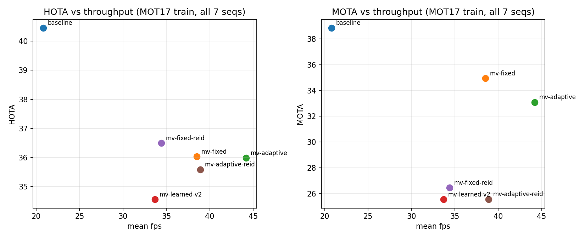
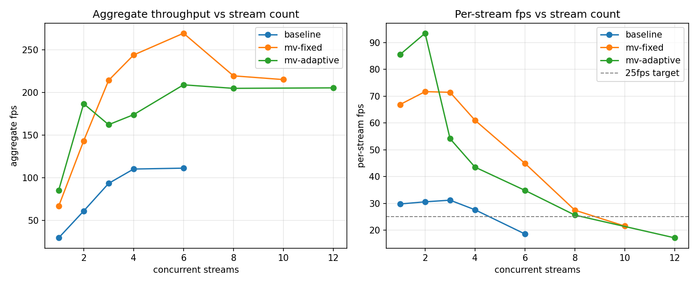
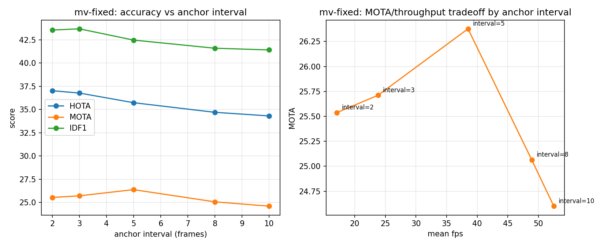

# mvtrack — compressed-domain video analytics on Apple Silicon

Multi-object detection + tracking that avoids fully decoding most video frames.
Codec side-information (H.264 motion vectors, block partitions) propagates
track boxes between sparse **anchor frames**, which are the only frames that
get full decode + neural-network inference. An adaptive scheduler decides
when to fire an anchor based on a residual-energy proxy and scene cuts.

Headline result: tracking accuracy (HOTA/MOTA/IDF1 on MOT17, via the official
TrackEval implementation) vs. throughput (fps, concurrent streams per chip)
on Apple Silicon (M4, PyTorch MPS, no CUDA/NVDEC).

## Results

All numbers are on real MOT17 train ground truth (7 FRCNN sequences),
YOLOv8s person-class detector (the project default — a ceiling check
confirmed YOLOv8n was leaving real accuracy on the table across every
pipeline) plus a fixed three-stage ByteTrack-style re-association in
`MVTracker`, a tuned `Adaptive` scheduler, and `max_age` tied to each
pipeline's real max anchor gap instead of a flat constant (see below).
Full detail and honest negative results in `findings.md`; per-session
narrative in `.claude/CLAUDE.md`.

| Pipeline | HOTA | MOTA | IDF1 | mean fps |
|---|---|---|---|---|
| baseline (full decode + detect every frame) | 40.5 | 38.9 | 48.6 | 20.8 |
| mv-fixed (anchor every 5th frame) | 36.0 | 34.9 | 42.4 | 38.5 |
| mv-adaptive (residual-energy-proxy scheduler, tuned, ~15-17% anchor rate) | 36.0 | 33.1 | 43.0 | 44.2 |
| mv-learned (mv-fixed + learned box correction) | 34.6 | 25.5 | 41.7 | 33.7 |
| mv-fixed + `--use-reid` (OSNet/MSMT17 appearance) | 36.5 | 26.4 | 43.6 | 34.4 |
| mv-adaptive + `--use-reid` | 35.6 | 25.6 | 43.1 | 38.9 |

mv-fixed's MOTA now trails baseline by only **10.1%** relative
(34.9 vs. 38.9), mv-adaptive by **14.85%** — both under a 15%-relative-drop
bar, up from ~32-35% before the `max_age` fix below. (The `--use-reid`
rows above predate this fix and are stale relative to the new default;
not re-run since ReID is opt-in and out of scope for this pass.)



MV propagation still trades real accuracy for real throughput — not a
free win — but about half of that gap turned out to be a fixable bug, not
an inherent cost. The original single-pass IoU re-association in
`MVTracker.step_anchor` spawned a brand-new track ID for any detection it
couldn't match, and an anchor-interval ablation showed this made *more*
anchors actively *hurt* MOTA (findings.md #7) — the opposite of intuition.
Rewriting it as a three-stage match (high-confidence detections vs. all
tracks, then low-confidence detections recovering tracks stage 1 missed,
then a loose-IoU "grace period" before spawning a new ID) eliminated the
inversion and roughly halved mv-fixed's MOTA gap to baseline (findings.md
#10). That fix also made anchors more valuable, so `Adaptive`'s untuned
defaults were now anchoring too rarely — a 16-combination grid search
against real MOTA (`scripts/tune_scheduler.py`, findings.md #11) restored
mv-adaptive to matching mv-fixed's accuracy while staying faster. Since
motion vectors carry zero appearance information, also tried blending a
learned embedding into association (`--use-reid`): a generic
ImageNet-pretrained backbone measured flat (diagnosed cause: classifier
features encode "a person," not "*this* person"), but swapping in OSNet
(pretrained on MSMT17, an actual person-ReID benchmark, zero training on
MOT17 so zero overfitting risk) gave a real HOTA/IDF1 gain on both
pipelines at an ~11-12% fps cost (findings.md #13) — kept opt-in given
the cost.

The remaining gap after all of that turned out to be a different bug, not
propagation drift: a recall probe bucketed by frames-since-last-anchor
showed recall was flat with distance from the anchor (even on the
hardest MOT17 sequence, ~43% at the anchor frame itself vs. ~43% four
frames later) — the loss wasn't accumulating drift. Comparing CLEAR
components directly showed why: false-negative counts matched baseline
almost exactly, but **false positives were 3.3x higher**. `MVTracker`
let a track missed at one anchor keep being propagated *and reported* as
a live box for up to `max_age=30` frames (~6 anchor cycles) before
pruning — a ghost-track bug. Tying `max_age` to each pipeline's real max
anchor gap (`anchor_interval` for mv-fixed, `scheduler.max_interval` for
mv-adaptive) fixed it — the single biggest MOTA win of any pass so far,
closing the relative gap to baseline from ~32-35% down to 10.1%/14.85%
(findings.md #15). A bigger detector (yolov8m) was tried as an
alternative fix first and rejected: it helped baseline (which sees every
frame) far more than mv-fixed (which only sees ~20% of frames), *widening*
the relative gap rather than closing it.

mv-adaptive still roughly doubles baseline's max concurrent-stream
capacity on the same chip at a fixed 25fps/stream quality bar (multi-stream
and ablation numbers below were measured on YOLOv8n with the pre-fix
tracker — not rerun since a slower detector only lowers these ceilings,
it doesn't change the baseline-vs-mv-* comparison):

| Pipeline | max concurrent streams @ >=25fps/stream |
|---|---|
| baseline | 4 |
| mv-fixed | 8 |
| mv-adaptive | 8 |



The anchor-interval ablation below (mv-fixed at intervals 2/3/5/8/10) is
the **post-fix** curve: MOTA is now roughly flat across the whole range
instead of rising monotonically, and HOTA/IDF1 decrease with larger
intervals as intuition would predict — see `findings.md` #7 and #10 for
the full before/after story.



## Layout

```
src/mvtrack/
  extract/   # bitstream -> motion-vector grids (PyAV)
  detect/    # YOLO wrapper (PyTorch MPS)
  track/     # MVTracker (IoU/Hungarian + MV propagation), CorrectionNet
  sched/     # FixedInterval and Adaptive anchor schedulers
  bench/     # multi-stream throughput harness
  mot_gt.py  # shared MOT17 ground-truth loader
eval/run.py  # MOT17 scoring harness (HOTA/CLEAR/Identity via TrackEval)
scripts/     # data prep, dataset builders, training, benchmarking, plots
results/     # committed CSVs + plots (reproducible, unlike gitignored outputs/)
```

## Setup

```bash
brew install ffmpeg
python3 -m venv .venv && source .venv/bin/activate
pip install -e .
```

MOT17 requires a Kaggle account + API token (`~/.kaggle/kaggle.json` —
Settings -> API -> Create New Token on kaggle.com), since the official
`motchallenge.net` host has been unreachable across many sessions:

```bash
kaggle datasets download -d wenhoujinjust/mot-17 -p data/
mv data/mot-17.zip data/MOT17.zip
python scripts/prep_mot17.py              # unzip + re-encode to H.264
```

## Quick start

```bash
python scripts/get_test_clip.py           # fetch + re-encode a small sample clip
python scripts/mv_demo.py                 # motion-vector extraction demo
python scripts/baseline_smoke.py          # full-decode detect+track baseline
```

## Evaluation

```bash
python eval/run.py --pipeline baseline                 # --weights yolov8s.pt is the default
python eval/run.py --pipeline mv-fixed --anchor-interval 5
python eval/run.py --pipeline mv-adaptive
python eval/run.py --pipeline mv-learned --correction-checkpoint correction_net_v2.pt
python eval/run.py --pipeline baseline --weights yolov8n.pt   # compare against the old default
python eval/run.py --pipeline mv-fixed --use-reid       # opt-in appearance-based re-id (see findings.md #13)
python scripts/tune_scheduler.py           # grid-search Adaptive's params against real MOTA
```

## Learned box correction (optional, stretch goal)

```bash
python scripts/build_correction_dataset.py     # single-step GT propagation-error pairs
python scripts/train_correction.py             # trains outputs/correction_net.pt
python scripts/build_rollout_dataset.py        # on-policy DAgger targets from that checkpoint
python scripts/train_correction.py --datasets outputs/correction_dataset.npz \
    outputs/correction_dataset_rollout.npz --out outputs/correction_net_v2.pt
```

## Benchmarking and plots

```bash
python scripts/bench_multistream.py --pipeline mv-adaptive \
    --video data/people_baseline.mp4 --streams 1 2 3 4 6 8
python scripts/make_plots.py              # regenerates results/plots/*.png from results/*.csv
```
